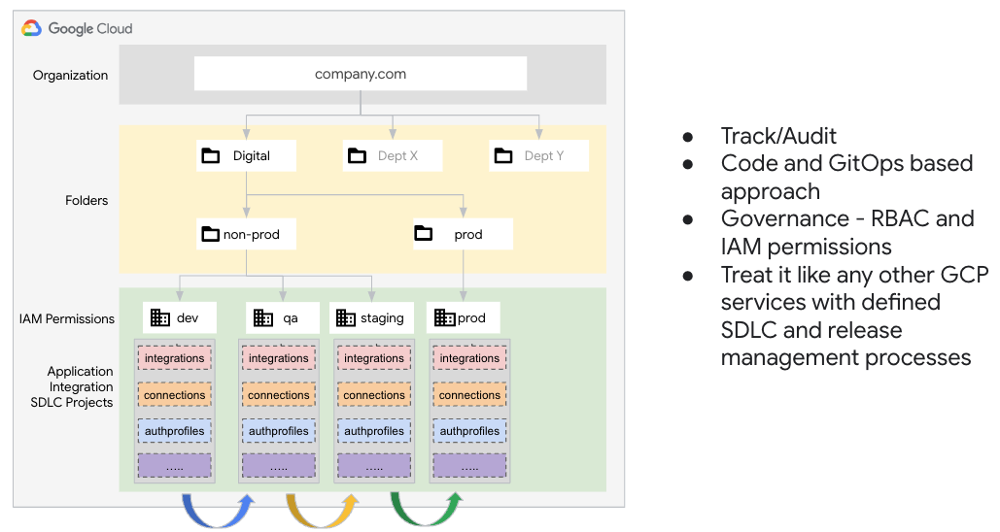
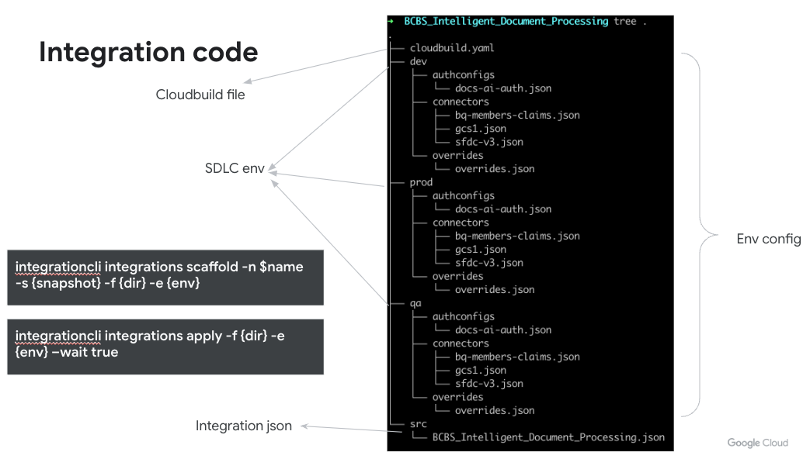
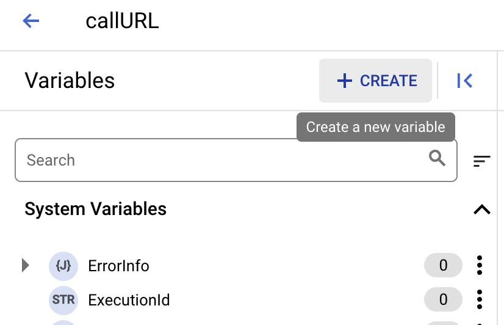
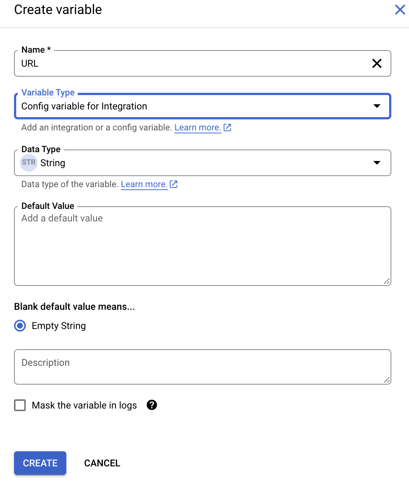
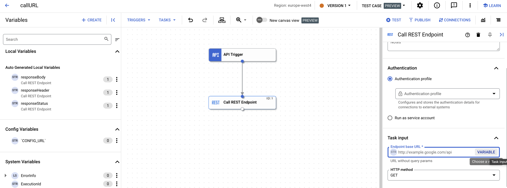
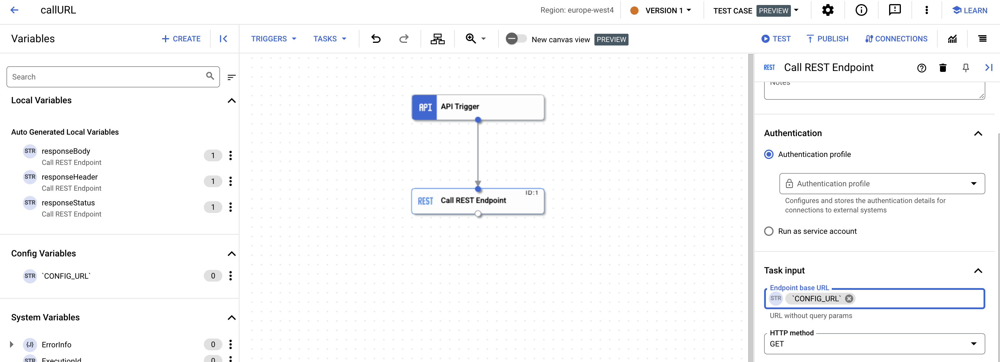
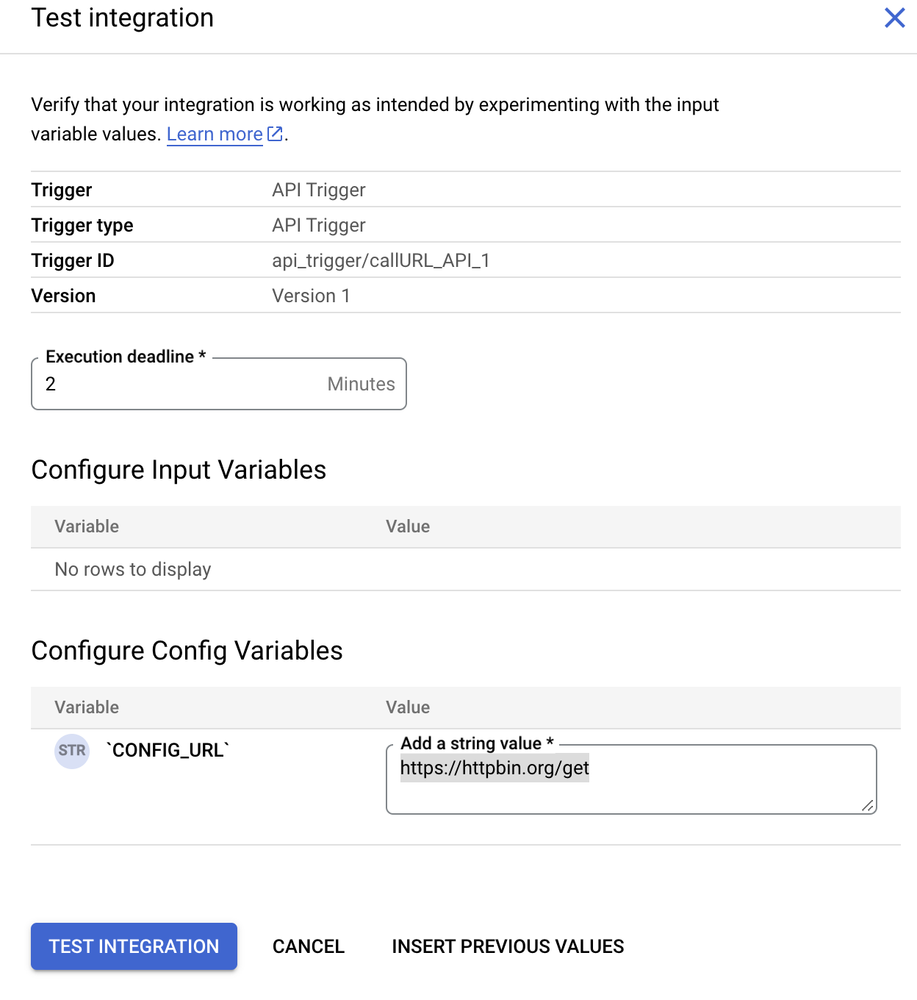
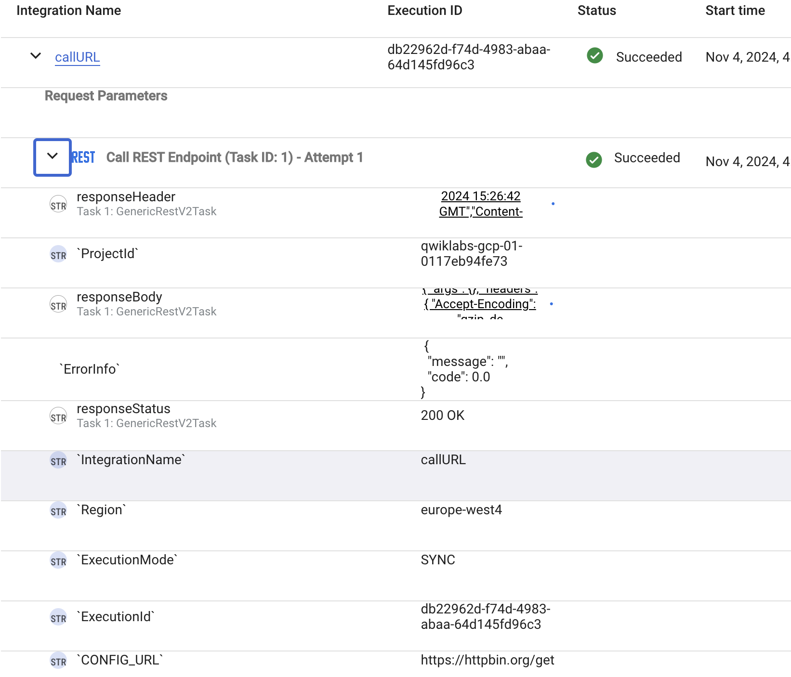

# IntegrationCLI

To enable production readines,, Application Integration offers a wrapper on top of Application Integration management APIs called "IntegrationCLI", available at https://github.com/GoogleCloudPlatform/application-integration-management-toolkit/tree/main.

The integrationCLI enables developers/admins to perform common operations using the CLI. This includes operations such as creating/deploying an integration, creating/updating a connector, managing custom connectors etc. The full list of operations supported by IntegrationCLI is available at https://github.com/GoogleCloudPlatform/application-integration-management-toolkit/blob/main/docs/integrationcli.md.

## Overview

Before going forward, it is important to understand the typical project structure used within Application Integration.



Like most GCP products, we recommend creating a separate GCP project to act as an "environment" for Application Integration and Connectors. Some artifacts that are part of your repository are the integration code itself, connections that are created along with it, authprofiles that are being used within the integration etc.

The integrationCLI allows you to "scaffold" (download) these artifacts using the scaffold command (https://github.com/GoogleCloudPlatform/application-integration-management-toolkit/blob/main/docs/integrationcli_integrations_scaffold.md), make changes to the artifacts based on the changes you need in upstream environments and deploy the artifacts to upstream environments. An example might be different credentials for dev vs. test environments, or the URLs for a target systems being different for dev vs. test environments. The IntegraionCLI command used to "deploy" these updated artifacts to a target environments is called "apply" (https://github.com/GoogleCloudPlatform/application-integration-management-toolkit/blob/main/docs/integrationcli_integrations_apply.md). 



# Properties that can be changed using IntegrationCLI

1. Config variables: Config variables are special variables within the integration flow that can be configured to have a different value per environment

2. Connector Configs: Connector configs, such as the connection name, authprofile used etc. can be configured to have a different value per environment

3. Overrides: There are multiple properties per integration that might change per environment, such as enabling/disabling cloud logging, enabling/disabling data masking etc., which might have a different value per environment.

# Create and test a simple integration with config variables

To demostrate the workings of IntegrationCLI, we would be developing a simple integration which would be triggered through an API trigger and would call another URL.

Go to the integration console, and create an integration named "callURL". Create a config variable named "URL"



Provide values for the config variable as shown in the screenshot below:



Drag and drop and API trigger and a REST task into the canvas, and connect both of them. After connecting them, click on the REST task and click "Variable" in the value "Endpoint Base URL" as shown in the screenshot below:



The final configuration should look like the below:



Click "Test" at the top.
As we can see, it is possible to provide a value for a config variable at the time of testing. Enter "https://httpbin.org/get" in the value and click on "TEST INTEGRATION"



Go to the logs, and expand the logs for the REST task. The URL being called is "https://httpbin.org/get".




# Install the Integration CLI

Click on "Cloud Shell" on the top right corner of the browser tab, which opens cloud shell in the browser.


Run the following commands in Cloud Shell:

```curl -L https://raw.githubusercontent.com/GoogleCloudPlatform/application-integration-management-toolkit/main/downloadLatest.sh | sh -
export PATH=$PATH:$HOME/.integrationcli/bin 

integrationcli --version

token=$(gcloud auth print-access-token)

project=<your_project_id>

region=<region_in_which_you_configured_Application_Integration>

integrationcli prefs set -p $project -r $region -t $token 
```

Your outputs should be as seen in the screenshot below:


# "Scaffold" the integration

Now, we are going to scaffold the integration we previously created, i.e., we are going to download the integration and all related artifacts in a pre-determined format.

First, create a directory in which the integration "callURL" will be downloaded.

``` mkdir callURL
```

The next command will scaffold the integration. The first parameter, -n, denotes the name of the integration to be scaffolded. The second parameter, -s, denotes the version of the integration to be scaffolded. The third parameter, -f, denotes the folder where the integration would be scaffolded. The fourth parameter, -e, denotes the environment which are scaffolding the integration from. Here the value is "dev", which denotes that we are scaffolding the integration from the development environment, i.e. all configurations are related to the development environment.

```integrationcli integrations scaffold -n callURL -s 1 -f callURL -e dev
```

A folder structure would be created in the directory "callURL". Explore the folder structure to see the various files and the properties that can modified within these files. In this lab, we will change the value of the URL in the REST task for the "QA" version of the integration.

To create properties for the QA version of the integration, we have to create a "QA" folder to house the QA properties similar to the "Dev" folder.

Perform the folowing commands:
cd callURL
cp -r dev qa
vim qa/config-variables/callURL-config.json

Insert the new value of the config variable for QA, i.e. "https://mocktarget.apigee.net/echo". The complete content of the file should be: "`CONFIG_URL`": "https://mocktarget.apigee.net/echo"

Save and return back to the command prompt. 

Now, we are ready to deploy the integration to our "QA" environment. In the real world, the QA environment would be another GCP project, thus you would set the value of the project again and update integrationcli preferences to use the new project value, but in this lab, we are working with just one GCP project, thus we will not do that. We would deploy the QA version of the integration in the same project where we developed the Dev version in, which means that the Dev version will be overwritten with the QA version of the integration. 

Run the following command:
integrationcli integrations apply -f . -e qa --wait=true

Go to the integration console, validate that the integration has been published very recently, and test the integration flow again. In the logs, the QA URL should be visible confirming that the deployment occured successfully.

