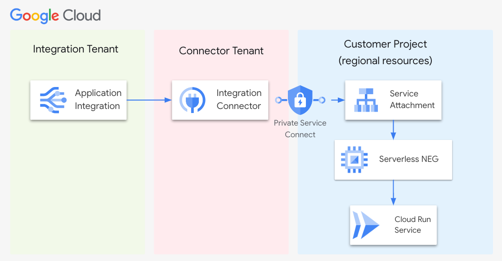
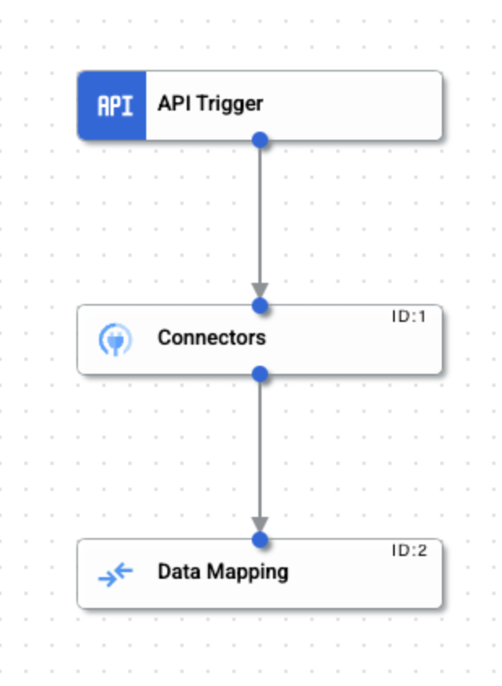

# HTTP PSC Demo

In this demo, we will use a HTTP Connector to connect to a Cloud Run service using Private Service Connect. 
The Cloud Run Service will be exposed using a Serverless NEG and then a PSC Service Attachment is created. Using that attachment, we will create an Endpoint and point the HTTP Connector to the Cloud Run service



# Pre-requisites
 
- A GCP project with permissions to create Cloud Run, network components like PSC, Load Balancer, Application Integration and Integration Connectors, etc
- Install [gcloud SDK](https://cloud.google.com/sdk/docs/install)
- Install [integrationcli](https://github.com/GoogleCloudPlatform/application-integration-management-toolkit)
    ```
    curl -L https://raw.githubusercontent.com/GoogleCloudPlatform/application-integration-management-toolkit/main/downloadLatest.sh | sh -
    ```
    Run `integrationcli --version` to make sure its installed correctly

# Installation

## Set up environment

1. Clone this repo
```sh
cd demos/http-psc-demo
```
2. Update env.sh and run

```sh
source env.sh
```

## Deploy the Cloud Run Service

Let's deploy a simple `whereami` service

```sh
gcloud run deploy $CLOUDRUN_SERVICE \
--platform=managed \
--image=us-docker.pkg.dev/google-samples/containers/gke/whereami:v1.2.22 \
--ingress=internal --min-instances=2 --max-instances=5 \
--no-allow-unauthenticated \
--region=$REGION --project=$PROJECT_ID
```
Fetch the Cloud Run service URL
```sh
export CLOUDRUN_URL=$(gcloud run services describe $CLOUDRUN_SERVICE --platform managed --region $REGION --format 'value(status.url)')
echo $CLOUDRUN_URL
```

Assign Cloud Run Invoker Role to the Default Compute Service Account
```sh
gcloud projects add-iam-policy-binding ${PROJECT_ID} \
    --member=serviceAccount:${PROJECT_NUMBER}-compute@developer.gserviceaccount.com \
    --role=roles/run.invoker
```


## Load Balancer setup

1. Create the custom VPC network (Skip if you already have a VPC)
```sh
gcloud compute networks create $NETWORK --subnet-mode=custom
```
2. Create a subnet in your VPC network (Skip if you already have a subnet)
```sh
gcloud compute networks subnets create $SUBNET \
--network=$NETWORK \
--range=10.1.3.0/24 \
--region=$REGION
```
3. Create a proxy-only subnet (Skip if you already have a proxy-only-subnet)
```sh
gcloud compute networks subnets create $PROXY_ONLY_SUBNET \
--purpose=REGIONAL_MANAGED_PROXY \
--role=ACTIVE \
--region=$REGION \
--network=$NETWORK \
--range=10.29.0.0/23
```
4. Reserve a static IP address for the load balancer
```sh
gcloud compute addresses create psc-ilb-ip --region=$REGION --subnet=$SUBNET --purpose=GCE_ENDPOINT
```
5. Create a serverless NEG for your Cloud Run service
```sh
gcloud compute network-endpoint-groups create $CLOUDRUN_SERVICE-neg \
--region=$REGION \
--network-endpoint-type=serverless  \
--cloud-run-service=$CLOUDRUN_SERVICE
```
6. Create a regional backend service
```sh
gcloud compute backend-services create psc-ilb-be \
--load-balancing-scheme=INTERNAL_MANAGED \
--protocol=HTTP \
--region=$REGION
```
7. Add the serverless NEG as a backend to the backend service
```sh
gcloud compute backend-services add-backend psc-ilb-be \
--region=$REGION \
--network-endpoint-group=$CLOUDRUN_SERVICE-neg \
--network-endpoint-group-region=$REGION
```
8. Create a regional URL map to route incoming requests to the backend service:
```sh
gcloud compute url-maps create psc-ilb \
--default-service=psc-ilb-be \
--region=$REGION
```
9. Create a regional target proxy to route requests to the URL map
```sh
gcloud compute target-http-proxies create psc-ilb-target \
--url-map=psc-ilb \
--region=$REGION
```
10. Create a forwarding rule to route incoming requests to the proxy. (NOTE: Since this is a demo, we are using HTTP for the ILB frontend)
```sh
gcloud compute forwarding-rules create psc-ilb-fwd-rule \
--load-balancing-scheme=INTERNAL_MANAGED \
--network-tier=PREMIUM \
--network=$NETWORK \
--subnet=$SUBNET \
--address=psc-ilb-ip \
--target-http-proxy=psc-ilb-target \
--target-http-proxy-region=$REGION \
--region=$REGION \
--ports=80
```

## Create Service Attachment

1. Create a subnet for Private Service Connect
```sh
gcloud compute networks subnets create $PSC_SUBNET_NAME \
--network=$NETWORK \
--region=$REGION \
--range=10.30.10.0/24 \
--purpose=PRIVATE_SERVICE_CONNECT
```
2. Publish a service with automatic approval (NOTE: Since this is a demo, using the automatic approval)
```sh
gcloud compute service-attachments create ilb-psc-attch \
--region=$REGION \
--target-service=https://www.googleapis.com/compute/v1/projects/$PROJECT_ID/regions/$REGION/forwardingRules/psc-ilb-fwd-rule \
--connection-preference=ACCEPT_AUTOMATIC \
--nat-subnets=$PSC_SUBNET_NAME
```

## Connector - Endpoint Attachment

1. Login to GCP console and navigate to Integration Connectors --> Endpoint Attachments
2. Clicl **+ CREATE**
3. Provide the following info:
   1. Name: psc-demo-endpoint
   2. Region: $REGION set in your env.sh
   3. Service Attachment: projects/$PROJECT_ID/regions/$REGION/serviceAttachments/ilb-psc-attch
4. Click **CREATE**
5. Copy the IP address for the endpoint attachment created

## HTTP Connector

1. In the GCP console, navigate to Integration Connectors --> Connections
2. Click **+ CREATE NEW**
3. Select the Location you have been using ($REGION)
4. In the Connection Details, provide the following:
   1. Connector: Select "Http"
   2. Connector Version: Select the latest version
   3. Connection Name: ilb-psc-conn
5. In the Destinations, provide the Endpoint IP from above in the host and `80` in port
6. In the Authentication, select `Service Account ID token Authentication`
7. Provide the Cloud Run URL for Audience
8. Click **CREATE**

**NOTE:** This can take a few minutes 

## Integration

1. Publish the Integration
```sh
TOKEN=$(gcloud auth print-access-token)
integrationcli preferences set -r $REGION -p $PROJECT_ID -t $TOKEN
integrationcli integrations apply -f ./demo-integration-sample -e dev --wait=true
```
2. Once complete, you should be able to see a new integration in your project.

3. Test it and see if you are getting a valid response from the Cloud Run Service